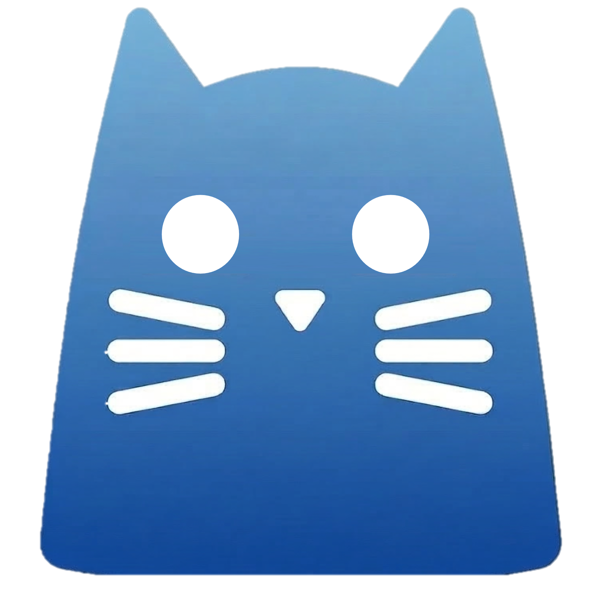
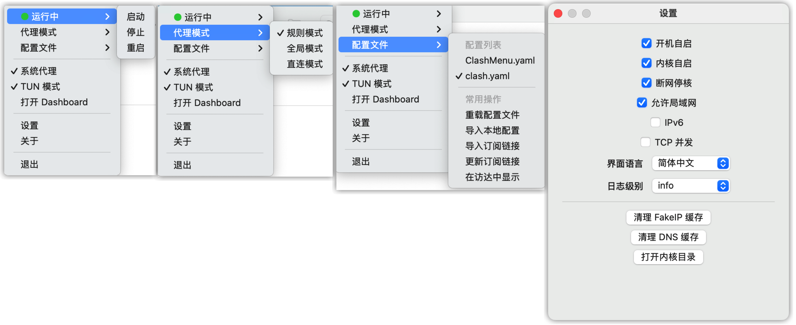

<div align="center">



# ClashMenu

原生 macOS 菜单栏代理客户端（SwiftUI + AppKit），以 `mihomo` 为 Core。

<p>
  
  
  
  
  <a href="https://t.me/clashbars" target="_blank" rel="noopener noreferrer">
    
  </a>
</p>

<p>
  <strong>加入 Telegram 群获取更新与支持：</strong>
  <a href="https://t.me/clashbars" target="_blank" rel="noopener noreferrer">@clashbars</a>
</p>

</div>



---

## 👋 项目简介

ClashMenu 是以macOS上裸核运行mihomo为目标的极简菜单栏客户端，基于 [ClashBar](https://github.com/Sitoi/ClashBar) 。  
在不打开复杂主窗口的前提下，你可以在菜单栏中完成配置管理、系统代理控制等常见操作，也可以打开zashboard获取详细信息和复杂操作。 ✨

## 🤖 项目说明

具体项目说明请参考 [ClashBar](https://github.com/Sitoi/ClashBar) 

## 🤖 项目构建

本项目不直接提供构建物下载，请clone源码后自行构建。
`Script/build.sh`
默认根据本机环境进行构建，也可根据脚本内容自定义构建物架构（arm/intel)。

## 🔄 内核目录与切换

运行时内核路径：

- `~/Library/Application Support/clashmenu/core/mihomo`

首次启动会将应用内置内核复制到上述目录。后续运行统一使用该路径，避免改写已签名的 app bundle。

切换内核步骤：

1. 在 ClashMenu 中执行 `Stop`，确保当前内核进程已停止。
2. 准备目标内核可执行文件（如 `mihomo`，命名需要保存一致）。
3. 返回 ClashMenu，执行 `Start` 或 `Restart`。

异常处理：

- 若切换后出现缓存兼容问题，可清理缓存后重试：

```bash
rm -f "$HOME/Library/Application Support/clashmenu/cache.db"
```

- 使用 TUN 模式时，切换内核后可能需要重新授权相关权限（root + setuid）。

## ❓ 常见问题

### 1) macOS 提示“已损坏”或“无法验证开发者” 🔒

**现象**：应用首次启动被系统拦截。  
**原因**：macOS Gatekeeper 对未公证应用的默认安全策略。

**处理步骤**

1. 将应用放置到 `/Applications/ClashMenu.app`。
2. 打开 **系统设置 → 隐私与安全性**，点击「仍要打开（Open Anyway）」。
3. 若仍被拦截，可移除隔离标记后重试：

```bash
sudo xattr -r -d com.apple.quarantine /Applications/ClashMenu.app
```

### 2) 系统代理开启失败 ⚙️

**现象**：点击系统代理开关后未生效或立即回退。  
**原因**：通常与权限授权、Helper 状态或应用安装位置有关。

**处理步骤**

1. 确认使用的是打包后的应用，并位于 `/Applications`。
2. 在 macOS 系统设置中完成 ClashMenu 相关权限批准。
3. 回到应用执行一次 `Restart` Core 后再次开启系统代理。
4. 如仍失败，打开 `Logs` 检查关键错误并提交 Issue。

### 3) 切换节点后网络无变化 🌐

**现象**：已切换 Proxy Group 或节点，但访问效果未变化。  
**原因**：常见于模式不匹配、节点未生效或配置未重载。

**处理步骤**

1. 执行一次延迟测试，确认目标节点可用。
2. 确认当前模式为 `Rule` 或 `Global`（避免误处于 `Direct`）。
3. 重新选择目标 Proxy Group/节点，并执行 `Restart` Core。

### 4) 远程配置更新后未生效 🔁

**现象**：远程更新成功，但节点或规则未刷新。  
**原因**：配置列表未重载或当前生效配置未切换到最新版本。

**处理步骤**

1. 先执行远程更新，再点击 `重载配置`。
2. 重新选择目标配置，确认当前生效项已切换。
3. 如仍异常，检查 `Logs` 中是否存在拉取失败或解析错误。

### 5) 请求没有按预期走代理 🧭

**现象**：部分域名/IP 走向与预期策略不一致。  
**原因**：通常是规则命中顺序、分流策略或配置内容导致。

**处理步骤**

1. 在 `Rules` 页面检查命中规则与策略结果。
2. 在 `Activity` 定位对应连接，核对目标地址与链路。
3. 在 `Logs` 通过关键词过滤交叉验证最终路由决策。

## 🙌 反馈与支持

- Telegram 社区：<https://t.me/clashbars>
- Issue / PR：欢迎提交功能建议、稳定性问题与文档修正。 💬

## 👥 贡献者

感谢所有参与贡献的开发者：

[](https://github.com/Sitoi/ClashBar/graphs/contributors)

## 🙏 致谢

- 感谢 [ClashBar](https://github.com/Sitoi/ClashBar) 提供了原始的项目能力
- 感谢 [OpenAI Codex](https://openai.com/codex/) 在需求拆解、工程实现与文档优化中的持续协作。 🤝
- 感谢 [MetaCubeX/mihomo](https://github.com/MetaCubeX/mihomo) 提供稳定可靠的 Core 能力。


## 📄 许可证

本项目采用 `GPL-3.0 license`，详见 [LICENSE](LICENSE)。
